# Machine Learning Platform

Bienvenue sur votre plateforme de Machine Learning facile à utiliser. Cette application interactive permet à toute personne, qu'elle soit novice ou expérimentée en data science, de développer et d'appliquer des modèles de machine learning sur leurs propres données, sans nécessiter de compétences en programmation.

Cette plateforme est conçue pour simplifier le processus de création de modèles de machine learning, de la préparation des données à la prédiction, en passant par l'entraînement et l'évaluation des modèles. Elle offre une interface utilisateur intuitive et des outils puissants pour vous aider à tirer le meilleur parti de vos données.

## Diagramme Use Cases

Un diagramme de cas d'utilisation est une représentation graphique dans le domaine de
l'ingénierie logicielle qui illustre les interactions entre les acteurs externes (utilisateurs ou
systèmes externes) et un système logiciel donné. Il met en évidence les différentes actions ou
fonctionnalités offertes par le système du point de vue de l'utilisateur, en se concentrant sur
ce que le système fait plutôt que sur comment il le fait. En résumé, un diagramme de cas
d'utilisation décrit les interactions entre les acteurs et le système, ainsi que les fonctionnalités
que le système propose pour répondre aux besoins des utilisateurs.

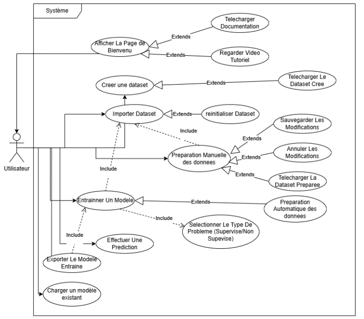

## Fonctionnalités

- **Importer des données** : Téléchargez vos propres fichiers CSV, Excel ou JSON pour commencer à travailler.
  
  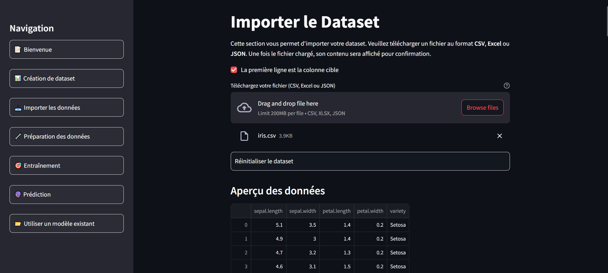

- **Préparer les données** : Nettoyez et transformez vos données pour les rendre prêtes à l'emploi.
  
  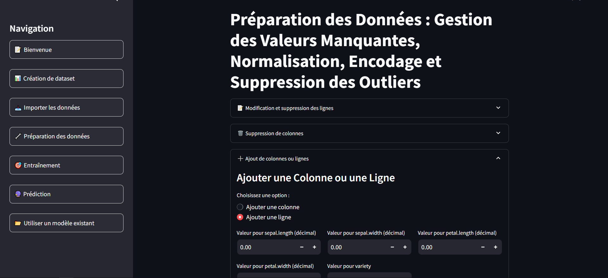

- **Entraîner des modèles** : Choisissez parmi plusieurs modèles populaires de machine learning pour entraîner votre propre modèle.
  
  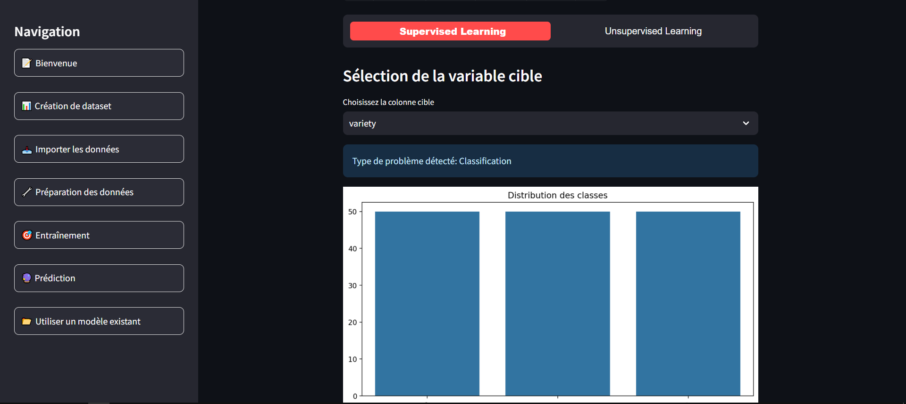

- **Tester et évaluer les résultats** : Testez les performances de votre modèle sur un jeu de données de test et comprenez ses résultats.
  
  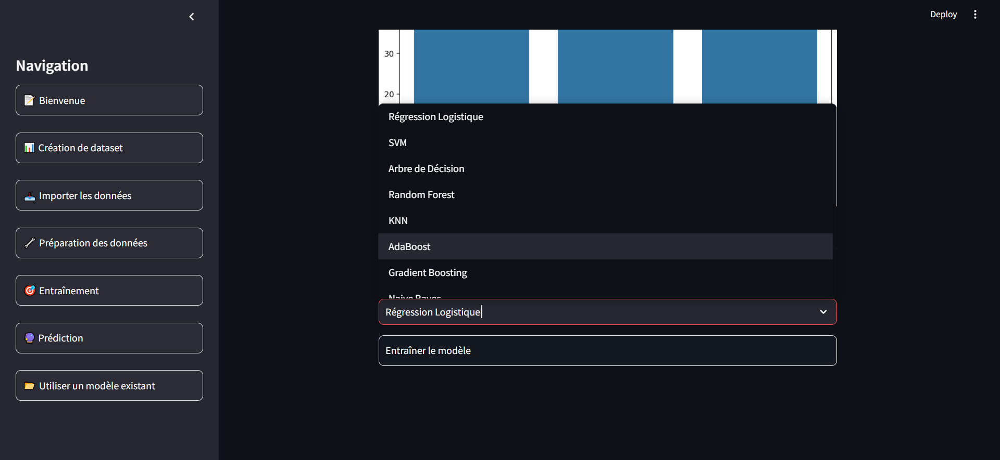

- **Exporter et importer des modèles** : Sauvegardez vos modèles pour une utilisation future ou chargez des modèles existants pour les utiliser directement.
  
  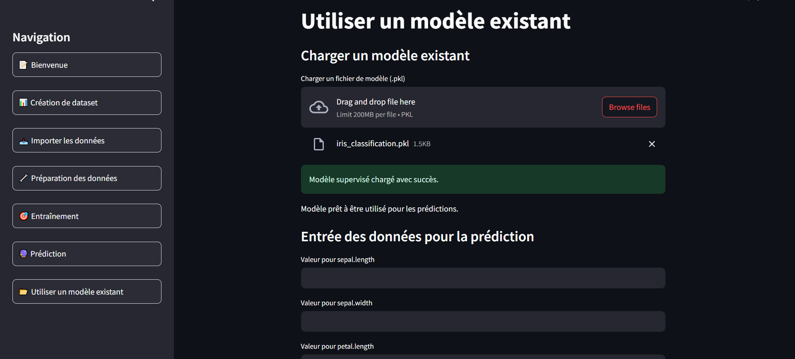

- **Prédiction** : Utilisez le modèle entraîné pour effectuer des prédictions sur de nouvelles données.
  
  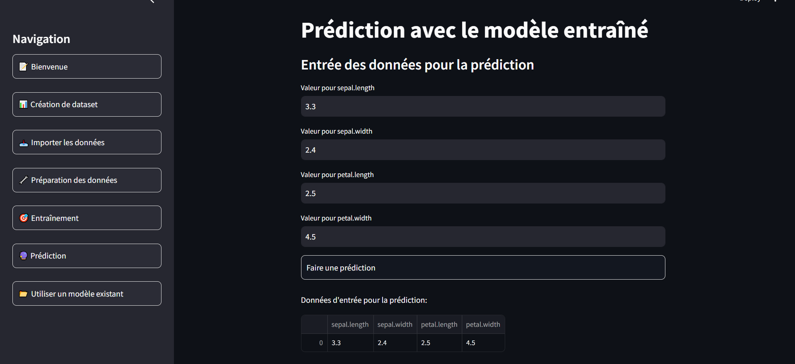

## Installation

1. Clonez le dépôt :
    ```bash
    git clone https://github.com/votre-utilisateur/machine-learning-app.git
    cd machine-learning-app
    ```

2. Installez les dépendances :
    ```bash
    pip install -r requirements.txt
    ```

3. Lancez l'application :
    ```bash
    streamlit run app.py
    ```

## Utilisation

### Navigation

L'application est divisée en plusieurs sections accessibles via la barre latérale :

- **Bienvenue** : Introduction à la plateforme et ses fonctionnalités.

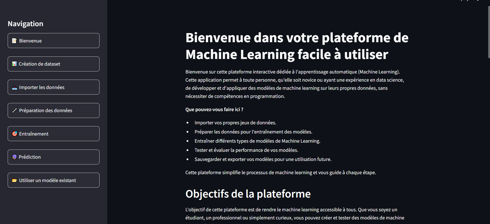

- **Création de dataset** : Créez un nouveau dataset en spécifiant le nombre de lignes et de colonnes.

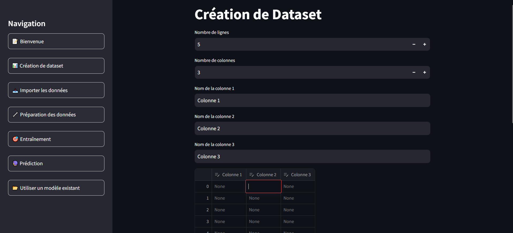

- **Importer les données** : Importez vos propres fichiers de données.


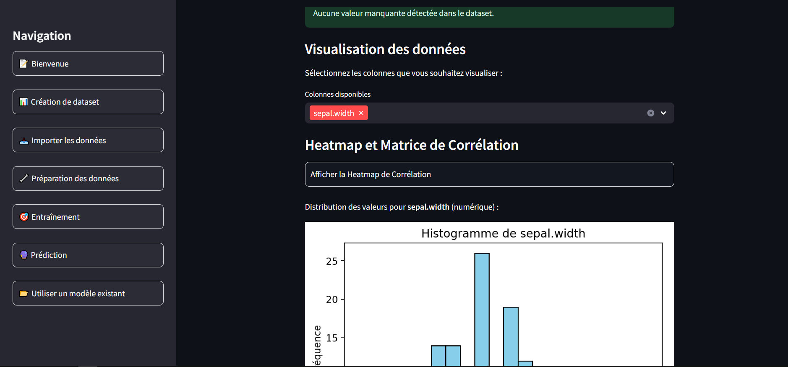

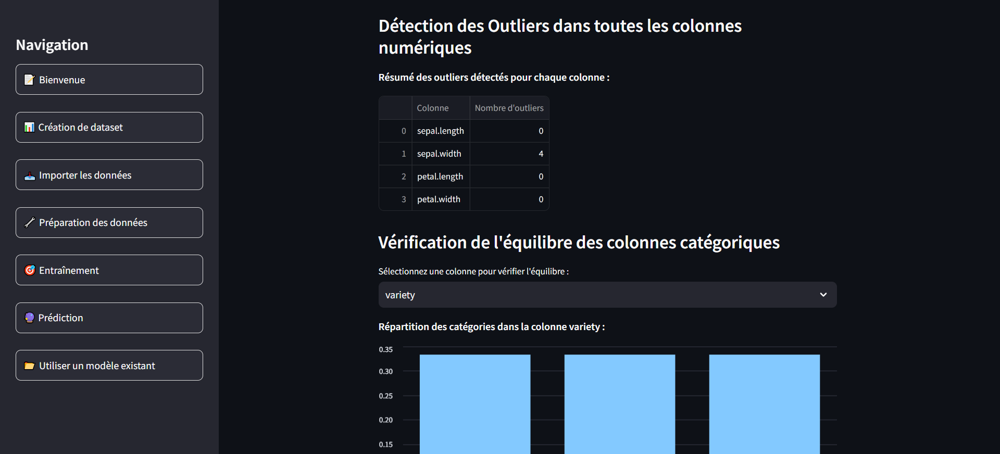

- **Préparation des données** : Nettoyez, normalisez, encodez et gérez les outliers dans vos données.


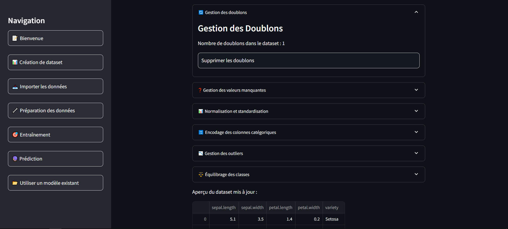

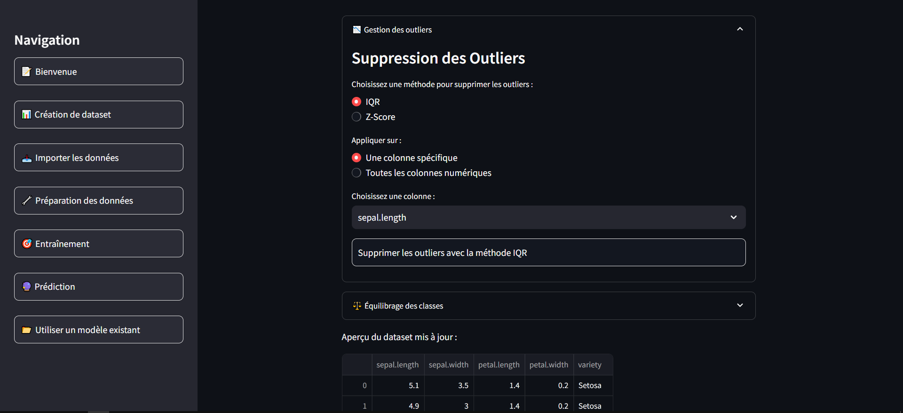

- **Entraînement** : Entraînez des modèles de machine learning sur vos données.


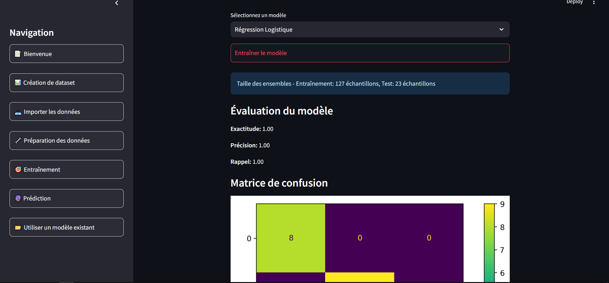

- **Prédiction** : Utilisez le modèle entraîné pour faire des prédictions.


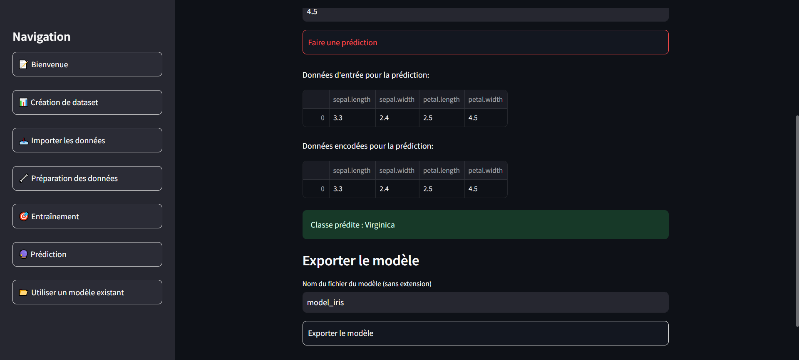

- **Utiliser un modèle existant** : Chargez et utilisez un modèle existant pour faire des prédictions.


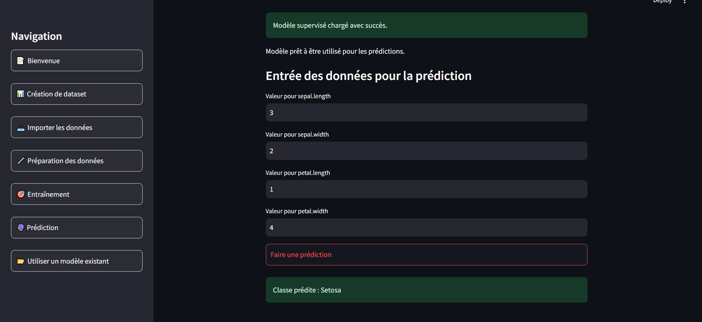

### Préparation des Données

- **Gestion des valeurs manquantes** : Remplissez ou supprimez les valeurs manquantes.
- **Normalisation et standardisation** : Appliquez des transformations pour normaliser ou standardiser les colonnes numériques.
- **Encodage des colonnes catégoriques** : Encodez les colonnes catégoriques en valeurs numériques.
- **Suppression des outliers** : Supprimez les outliers en utilisant les méthodes IQR ou Z-Score.
- **Équilibrage des classes** : Équilibrez les classes dans le dataset en utilisant l'oversampling ou l'undersampling.

### Entraînement et Prédiction

- **Entraînement** : Sélectionnez un modèle, entraînez-le sur vos données et évaluez ses performances.
- **Prédiction** : Utilisez le modèle entraîné pour faire des prédictions sur de nouvelles données.


